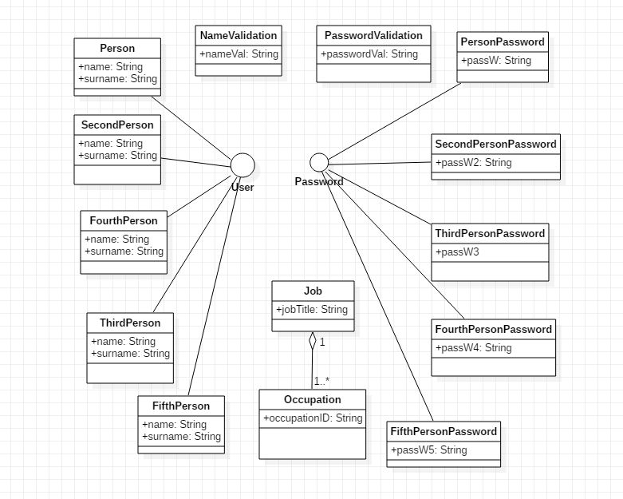

# assignment6

The password management system is a system that keeps passwords for users in a company.

To store their passwords, users have to sign in with thier namem, userID, surname and password.

